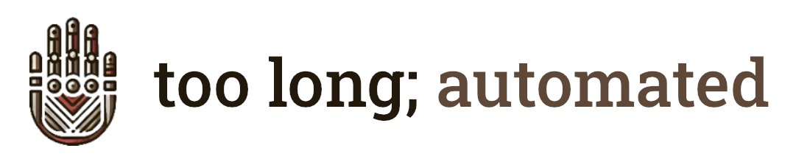
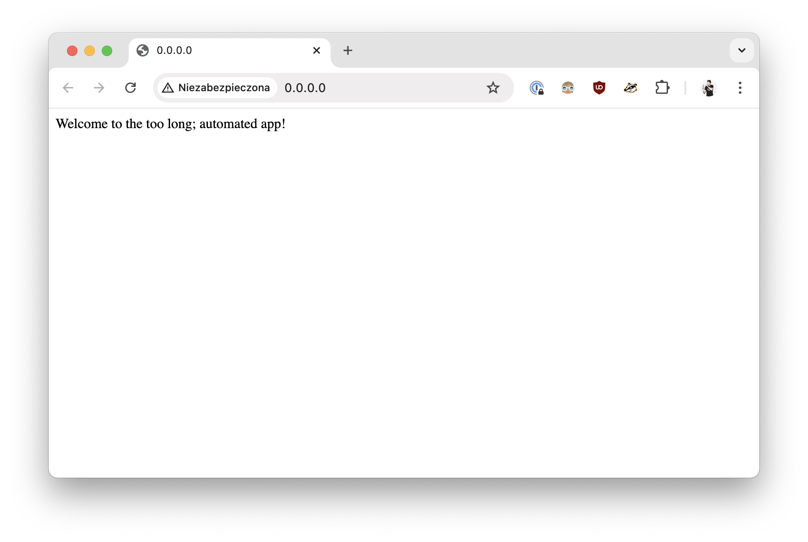

# Tutorial #1: one branch to rule them all



📓 Code in this repository is a supplementary material to the following series
on the `too long; automated` blog: [one branch to rule them
all](https://toolongautomated.com/posts/2024/one-branch-to-rule-them-all-1).

## Introduction

This tutorial will show you how to:
- develop your code in a simple git flow, based on a [permissive trunk-based
    branching strategy](https://www.toolongautomated.com/posts/2024/one-branch-to-rule-them-all-1.html#option-2-permissive-trunk-based-development)
- version an application using git tags and Docker image tags
- build and push Docker images
- deploy the application to Cloud Run (staging and production environments)
- configure deployments using `.env` files
- `🚀 tl; a`: automate tagging, building and pushing Docker images, and
    deploying the application to Cloud Run.

If you'd like to implement the tutorial step-by-step, several git tags are here,
marking important milestones. Use `git checkout [TAG]` to explore the code
locally, or click on the link in the list below to see it in GitHub's UI:

| Step | Tag | URL | diff from the previous tag |
|:---|:---|:---:|:---:|
| Starting point | `1-reference-point` | [click](https://github.com/toolongautomated/tutorial-1/tree/1-reference-point) | - |
| Application versioning | `2-application-versioning` | [click](https://github.com/toolongautomated/tutorial-1/tree/2-application-versioning) | [diff](https://github.com/toolongautomated/tutorial-1/compare/1-reference-point...2-application-versioning) |
| Environment configuration | `3-environment-configuration` | [click](https://github.com/toolongautomated/tutorial-1/tree/3-environment-configuration) | [diff](https://github.com/toolongautomated/tutorial-1/compare/2-application-versioning...3-environment-configuration) |
| Deployment | `4-deployment` | [click](https://github.com/toolongautomated/tutorial-1/tree/4-deployment) | [diff](https://github.com/toolongautomated/tutorial-1/compare/3-environment-configuration...4-deployment) |
| Automations | `5-automations` | [click](https://github.com/toolongautomated/tutorial-1/tree/5-automations) | [diff](https://github.com/toolongautomated/tutorial-1/compare/4-deployment...5-automations) |

## Prerequisites

- `docker` >= 27.2.0
- `python` >= 3.10.4

## How to run locally

`app/src` directory contains a simple Flask server that prints a welcome
message.

First, install the requirements:

```shell
cd app
pip install -r requirements.txt
```

Next, run the application:

```shell
cd app/src
export FLASK_APP=main.py
gunicorn -w 4 -b 0.0.0.0:80 main:app
```

Finally, go to `http://0.0.0.0:80` in your browser. You should see the welcome text:



### Tests

`app/test` directory contains unit and integration tests.

To run the tests, first install the requirements:

```shell
cd app
pip install -r requirements-test.txt
```

Then, run the tests:

```shell
pytest test/unit
```

## Application versioning

The application is versioned using [semantic versioning](https://semver.org/)
approach. Whenever application-related files are added/removed/changed, a new
version should should be added to the [CHANGELOG](app/CHANGELOG.md).

## Recommended git flow

To add a new feature, follow these steps:

1. Create a new branch from the `main` branch.
1. Add the new feature to the application.
1. Add a new entry to the [CHANGELOG](app/CHANGELOG.md).
1. Open a PR to the `main` branch.
1. Once approved, merge the code.
1. `🚀 tl; a`:
   1. git tag will be created automatically
   1. Docker image will be built and pushed to the registry of your choice
      (Docker Hub in this tutorial)
   1. if any `.env` files are changed, the application will be deployed
      to the corresponding Cloud Run environment

If you'd like to learn how to perform steps from point 6 manually, here you are:
- [git tagging](https://www.toolongautomated.com/posts/2024/one-branch-to-rule-them-all-2.html#git-tagging)
- [build and push Docker images](https://www.toolongautomated.com/posts/2024/one-branch-to-rule-them-all-2.html#containerize-the-application)
- [configure `gcloud` CLI](https://www.toolongautomated.com/posts/2025/one-branch-to-rule-them-all-3.html#configure-gcloud-cli)
- [deploy to Cloud Run](https://www.toolongautomated.com/posts/2025/one-branch-to-rule-them-all-3.html#deploy-to-cloud-run)
